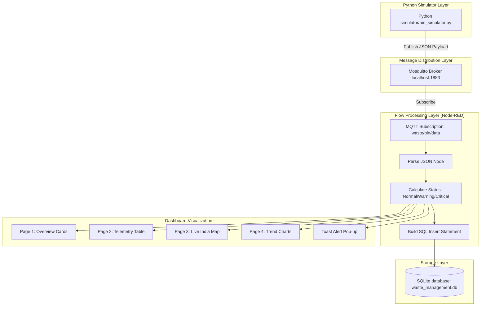

# Smart Waste Management System for Metropolitan Cities

A complete, beginner-friendly, and fully functional Smart Waste Management System designed for academic demonstrations, final-year engineering projects, and GitHub portfolios.

This project simulates garbage bins across metropolitan cities, publishes telemetry data via MQTT, processes it using Node-RED, saves the records to a local SQLite database, and visualizes the telemetry on a real-time web dashboard.

---

## 📌 Project Overview
Metropolitan cities face huge challenges in monitoring garbage bins manually. Bins that are left overflowing create severe hygiene issues, unpleasant odor, and high operational costs due to inefficient truck routing.

The **Smart Waste Management System** digitizes this process. It monitors fill levels, weight, and geographical coordinates of 5 separate garbage bins in real time. Whenever a bin's fill level exceeds a critical threshold (80%), the system raises a toast notification on the dashboard and indicates the status visually. It also logs every packet to an SQLite database for history tracking and trends plotting.

---

## ⚙️ Technology Stack

* **Programming Language:** Python 3.x
* **IoT Protocols:** MQTT Protocol
* **MQTT Broker:** Mosquitto MQTT Broker (Running locally)
* **Flow Creator & Routing:** Node-RED
* **Visualization Dashboard:** Node-RED Dashboard (`node-red-dashboard`)
* **Interactive Maps:** Node-RED Worldmap (`node-red-contrib-web-worldmap`)
* **Database Engine:** SQLite (File-based database, no installation needed)

---

## 🌐 Project Architecture



---

## 🗺️ Fixed Garbage Bin Locations
The system monitors 5 bins placed at fixed geographical coordinates:

| Bin ID | City | Latitude | Longitude |
| :--- | :--- | :--- | :--- |
| **BIN001** | Pune | 18.5204 | 73.8567 |
| **BIN002** | Mumbai | 19.0760 | 72.8777 |
| **BIN003** | Bengaluru | 12.9716 | 77.5946 |
| **BIN004** | Delhi | 28.7041 | 77.1025 |
| **BIN005** | Chennai | 13.0827 | 80.2707 |

---

## 🚀 Installation and Setup

Detailed installation steps are provided in the [Installation Guide](./docs/installation_guide.md). Below is the summary sequence:

### 1. Python Environment Setup
Create a virtual environment, activate it, and install the dependencies:
```powershell
# Navigate to the project directory
cd d:\projects\smart-waste-management-system

# Create virtual environment
python -m venv venv

# Activate virtual environment (PowerShell)
.\venv\Scripts\Activate.ps1
# OR Activate virtual environment (Command Prompt)
.\venv\Scripts\activate.bat

# Install dependencies inside the virtual environment
pip install -r requirements.txt
```

### 2. Mosquitto Broker Setup
Download and run the installer from the [Mosquitto Downloads page](https://mosquitto.org/download/). On Windows, it will start automatically as a service.

### 3. Node-RED Configuration
1. Install Node-RED globally: `npm install -g --unsafe-perm node-red`
2. Start Node-RED by running `node-red` in your terminal.
3. Open `http://localhost:1880` in your web browser.
4. Open the Palette Manager (**Menu -> Manage palette**) and install:
   - `node-red-dashboard`
   - `node-red-contrib-web-worldmap`
   - `node-red-node-sqlite`
5. Import [waste_flow.json](./node_red/waste_flow.json) (**Menu -> Import**).
6. Click **Deploy** in the top-right.

---

## 🏃 Running Instructions

1. **Start the MQTT Broker** (Verify port 1883 is listening).
2. **Start Node-RED** and verify the flow is deployed.
3. **Run the Simulator:**
   ```bash
   python simulator/bin_simulator.py
   ```
4. **Open the Dashboard:**
   Go to `http://localhost:1880/ui/` in your browser.

---

## 📈 Dashboard Explanation

The dashboard has 4 tabbed pages:

1. **Overview Page:**
   - **Bin Counts Summary:** Cards showing the number of Bins in Normal, Warning, and Critical states.
   - **System Statistics:** Live counter showing the "Total Records Logged" and "Last Updated Time" (updates every 5 seconds).
2. **Bin Monitoring:**
   - A live, self-updating data table displaying Bin IDs, Fill Levels (%), Weight (kg), and Status (Normal, Warning, Critical) side-by-side.
3. **Bin Locations Map:**
   - An interactive map centered on India.
   - Bins are marked with pins colored by status: **Green** (Normal), **Orange** (Warning), or **Red** (Critical).
   - Clicking a pin shows real-time stats in a popup.
4. **Analytics & Trends:**
   - Two line charts showing the historical rise and fall of Fill Level (%) and Weight (kg) for all 5 bins.

---

## 🖼️ Dashboard Mockup Preview
A visual representation of the web dashboard in dark mode:


---

## 🧪 Testing and Database Inspection

Please refer to the [Testing Guide](./docs/testing_guide.md) to learn how to:
- Monitor simulator console output.
- Query SQLite records directly from the command prompt.
- Confirm dashboard notifications (toasts) when fill level exceeds 80%.
- Observe simulated garbage collection truck runs.

---

## 🛠️ Deployment and Viva Tips

For tips on setting up these processes as background tasks and preparing presentation slides/viva scripts for academics, see the [Deployment Guide](./docs/deployment_guide.md).

---

## 🔮 Future Scope
The core architecture is built to be easily expandable. In future iterations, students or developers can implement:

1. **Route Optimization:** Calculate the shortest pathway for garbage collection trucks using the TSP (Traveling Salesperson Problem) algorithm based on GPS coordinates of critical bins.
2. **Predictive Maintenance:** Forecast when a bin will become full based on historical fill rates using linear regression models.
3. **Waste Analytics:** Aggregate hourly and daily fill patterns to identify peak garbage generation periods in specific metropolitan sectors.
