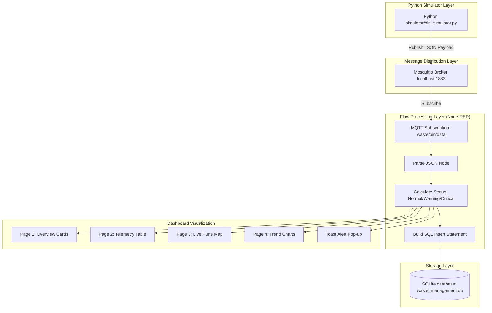
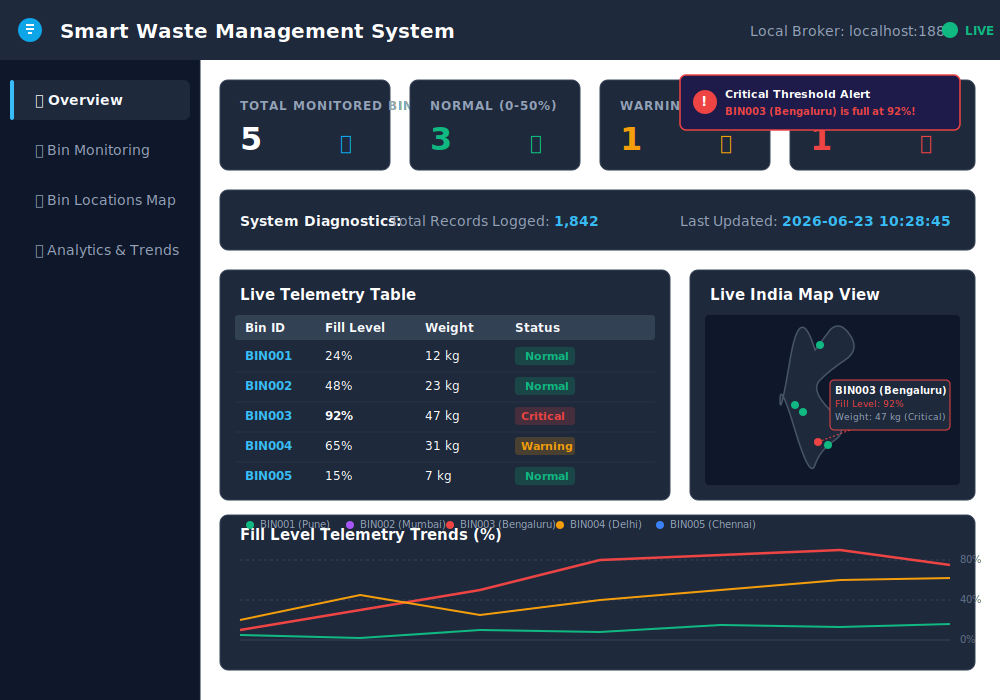

# Smart Waste Management System

Smart Waste Management System is an IoT-based monitoring solution that simulates waste bins, processes telemetry data using MQTT and Node-RED, stores records in SQLite, and visualizes real-time information through an interactive dashboard.

The system monitors garbage bin fill levels, weight, and geographical locations in real time. It generates alerts when bins reach critical capacity and provides centralized monitoring through a web dashboard.

---

## 📌 Project Overview
The accumulation of solid waste in urban environments requires efficient monitoring to optimize collection cycles and maintain public hygiene. 

This system provides:
* **Real-Time Visibility**: Monitored tracking of fill levels, weight, and operational status across multiple waste bins.
* **Alert Generation**: Automatic, instant threshold alerts (toast notifications) when any bin exceeds 80% capacity.
* **Location Tracking**: Interactive mapping of bins with coordinates and color-coded markers indicating real-time status.
* **Data Storage**: Localized, structured telemetry history logging to an SQLite database.
* **Dashboard Visualization**: A clean, centralized web interface offering system statistics, live tables, and trends.

---

## ⚙️ Technology Stack

* **Programming Language:** Python 3.x
* **IoT Protocol:** MQTT (Message Queuing Telemetry Transport)
* **MQTT Broker:** Mosquitto MQTT Broker (Running locally)
* **Flow Creator & Routing:** Node-RED
* **Visualization Dashboard:** Node-RED Dashboard (`node-red-dashboard`)
* **Interactive Maps:** Node-RED Worldmap (`node-red-contrib-web-worldmap`)
* **Database Engine:** SQLite (File-based relational database)

---

## 🌐 System Architecture



---

## 🗺️ Monitored Bins Configuration
The system simulates 5 distinct garbage bins at fixed geographical positions in Pune:

| Bin ID | Location | Latitude | Longitude |
| :--- | :--- | :--- | :--- |
| **BIN001** | Pune (Kothrud) | 18.5074 | 73.8077 |
| **BIN002** | Pune (Koregaon Park) | 18.5362 | 73.8940 |
| **BIN003** | Pune (Shivajinagar) | 18.5314 | 73.8446 |
| **BIN004** | Pune (Viman Nagar) | 18.5679 | 73.9143 |
| **BIN005** | Pune (Hadapsar) | 18.5089 | 73.9260 |

---

## 🚀 Setup and Installation

For detailed setup procedures covering Python, Mosquitto MQTT Broker, and Node-RED configuration, please refer to the [Installation Guide](./docs/installation_guide.md).

### Quick Start

1. **Install Python Dependencies**:
   ```powershell
   pip install -r requirements.txt
   ```
2. **Install Node-RED Nodes**:
   Add the following packages via your Node-RED Palette Manager (*Menu -> Manage palette -> Install*):
   - `node-red-dashboard`
   - `node-red-contrib-web-worldmap`
   - `node-red-node-sqlite`
3. **Import Flow File**:
   Copy the contents of [waste_flow.json](./node_red/waste_flow.json) and import them into Node-RED (*Menu -> Import*). Click **Deploy** to start processing the flow.

---

## 🏃 Running Instructions

1. **Verify Services**: Ensure that the Mosquitto MQTT Broker is running locally on port `1883`.
2. **Start Node-RED**: Open a terminal and run:
   ```bash
   node-red
   ```
3. **Launch the Simulator**:
   ```powershell
   python simulator/bin_simulator.py
   ```
4. **Access the Interface**: Open your browser and navigate to:
   ```text
   http://localhost:1880/ui/
   ```

---

## 📈 Dashboard Interface

The interactive dashboard is organized into four main telemetry views:

1. **Overview**: Real-time summary statistics including total records logged, last update timestamp, and the count of bins categorized by current operational state (Normal, Warning, Critical).
2. **Bin Monitoring**: A live tabular representation listing fill levels, total weights, and active statuses.
3. **Bin Locations Map**: A spatial overview centered on the monitored area showing interactive pins. Markers are dynamically color-coded: **Green** (Normal, 0-50%), **Orange** (Warning, 51-80%), and **Red** (Critical, 81-100%).
4. **Analytics & Trends**: Historical line graphs tracking fill levels and weights over runtime cycles for comparative analysis.

---

## 🖼️ Dashboard Preview
A dark-mode representation of the web dashboard:



---

## 🧪 Testing and Verification

To verify database consistency, alert mechanisms, and simulated garbage collection events, refer to the [Testing Guide](./docs/testing_guide.md).

---

## ⚙️ Deployment Guide

For instructions on running the system components in production/background mode (e.g., Mosquitto Service, Node-RED with PM2, and running the pythonw background simulator task), refer to the [Deployment Guide](./docs/deployment_guide.md).

---

## 🔮 Future Scope

1. Integration with Real Sensors (ESP32 + Ultrasonic Sensors)
2. Cloud Deployment (AWS / IBM Cloud)
3. Mobile Notification Support
4. Multi-City Waste Monitoring
5. Historical Reporting Dashboard
6. Smart Collection Vehicle Integration
